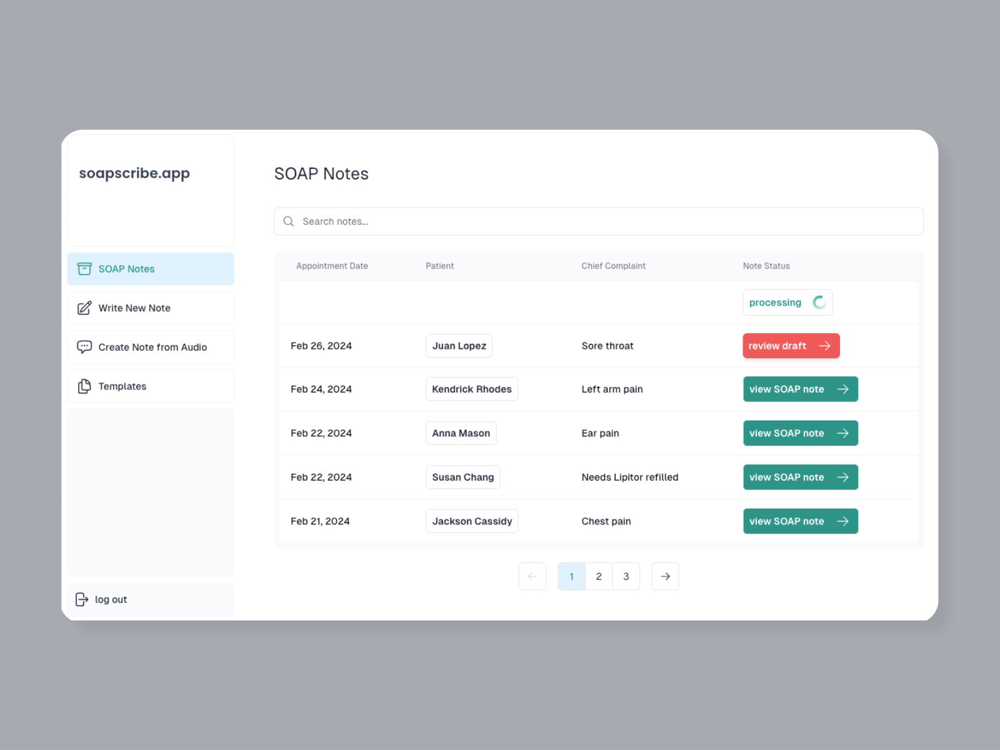

## soapscribe.app

[soapscribe.app](https://soapscribe.vercel.app/) automatically generates structured SOAP notes from clinical audio memos or entire telehealth appointment recordings.

[soapscribe.app](https://soapscribe.vercel.app/) saves healthcare providers time by drafting structured SOAP notes. Providers can upload an audio memo reflecting on the appointment or they can upload a recording of the entire appointment - soapscribe takes care of drafting a structured clinical note for easy review and approval. Soapscribe also provides a second opinion for the clinician, giving them a chance to catch any potentially overlooked issues.

### GIF demo:

## Tech stack:

**Frontend:**
Next.js, React, Tailwind, Typescript

**Backend:**
Supabase (auth, storage, vectordb), Vercel (serverless functions)

**Deployment:**
Vercel

**APIs:**
Replicate, OpenAI
