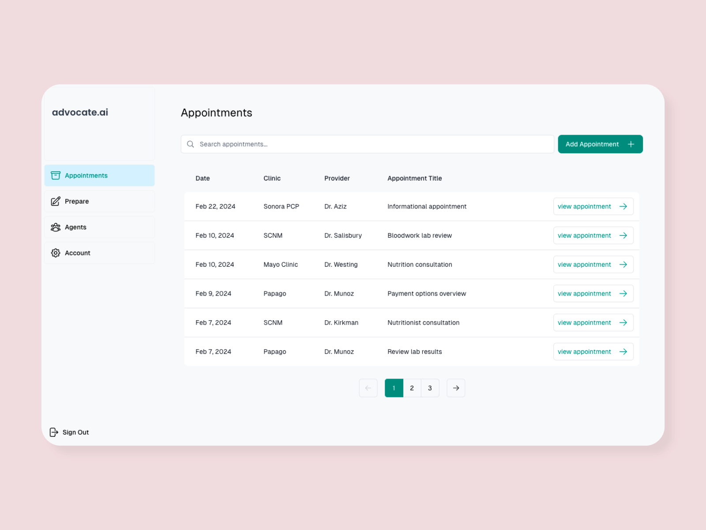
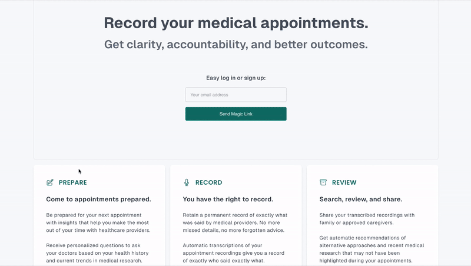

## advocate.ai

[advocate.ai](https://advocateai.vercel.app/) is a health advocate tool that helps patients and caregivers prepare for, record, and review medical appointments.

advocate.ai helps people turn audio recordings of their medical appointments into searchable transcriptions. The site also scans each appointment for potential concerns or irregularities, provides automatic feedback and accountability reminders based on the doctor’s recommendations, and helps patients prepare for their upcoming medical appointments. 

### How the site works: [1-minute demo video](https://youtu.be/8egWnTs9TM8)

### Why I built this: [1-minute founder intro](https://youtu.be/OKYhPXrVUIw)

### GIF demo:

## Tech stack:

**Frontend:**
Next.js, React, Tailwind, Typescript

**Backend:**
Supabase (auth, storage, vectordb), Vercel (serverless functions)

**Deployment:**
Vercel

**APIs:**
Replicate, Exa, OpenAI