# Model and Prompt Evals for a Clinical Charting App Using LLMs in Production

[**soapnotescribe**](https://github.com/josephrmartinez/soapnotescribe) is a web application that utilizes AI to automatically generate structured SOAP notes from telehealth appointment recordings or clinical audio memos.

The application workflow involves first sending the audio of the medical appointment to a speech-to-text model hosted by Replicate. The transcribed text is then processed by a large language model (served by OpenAI or Anthropic) to organize the content into a structured data object, which is subsequently presented to the physician as a SOAP note.

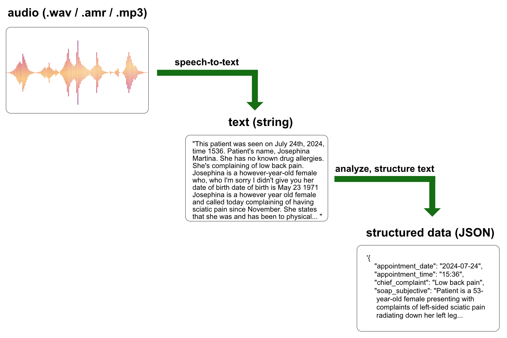

"SOAP" is an acronym for a standard template structure used by healthcare professionals to document patient encounters:

- **Subjective**: Patient's own words about symptoms and concerns.
- **Objective**: Measurable data from exams and tests.
- **Assessment**: Healthcare provider's diagnosis or analysis.
- **Plan**: Treatment and follow-up recommendations.

The transcription is performed using an optimized Whisper model, which takes approximately 6 seconds and costs around $0.005 for 5 minutes of audio.

A variety of LLM models can transform the transcription into a structured SOAP note. While all major foundational models can generate acceptable SOAP notes, they differ significantly in completion times, costs, and quality.

Previously, model selection was based mainly on minimizing costs and a general assessment of the outputs' acceptability. However, there was no systematic approach to understanding the performance and output differences between models.

The objective of this notebook is to establish a systematic evaluation process for selecting the LLM model and prompt used to convert audio transcriptions into structured SOAP notes.

Goals:

- **Identify Key Metrics**: Determine the most critical outcomes for this use case, such as cost, speed, and accuracy in specific fields of the returned JSON object.
- **Performance Measurement**: Analyze and measure the performance of different models on these key variables.
- **Prompt Optimization**: Refine the prompt to improve the quality and relevance of the generated SOAP notes.
- **Model Selection**: Choose the optimal model based on a comprehensive evaluation of performance, cost, and suitability for this specific use case.
- **Preparedness for New Models**: Develop a framework for immediate analysis and evaluation when new models are released, enabling a clear understanding of the costs and benefits of switching models.

Prior to running this notebook, I was using the Claude 3.5 Sonnet model from Anthropic for analyzing the transcriptions and returning a SOAP note as a JSON object. As a result of building and running this notebook, I updated my prompt and switched to a different model. I am also better positioned to immediately evaluate new models released by Anthropic or OpenAI, allowing me to systematically determine the costs and benefits of updating to the latest models.

```python
!pip install openai
!pip install anthropic
!pip install matplotlib
```

```python
import pandas as pd
import matplotlib.pyplot as plt
import os
import time
import json
from openai import OpenAI
import anthropic
```

```python
from google.colab import drive
drive.mount('/content/drive')
```

```python
from google.colab import userdata
OPENAI_API_KEY = userdata.get('OPENAI_API_KEY')
ANTHROPIC_API_KEY = userdata.get('ANTHROPIC_API_KEY')
```

```python
openai = OpenAI(api_key=OPENAI_API_KEY)
anthropic = anthropic.Anthropic(api_key=ANTHROPIC_API_KEY)
```

```python
system_content_string = f"""
You are a helpful, highly-trained medical assistant. Carefully review the following TRANSCRIPT and generate a clinical SOAP note as a JSON object.
Your answer MUST begin and end with curly brackets. Do not include any leading backticks or other markers. ALL LISTS SHOULD BE UNORDERED AND STYLED WITH A SIMPLE DASH. NO NUMBERED LISTS. Include as much specific information as possible from the transcript in the SOAP note. Be thorough! If you do not have the information required to provide a value in any of the fields, just return the JSON object WITHOUT those fields. Do NOT return a field with an empty string or an "unknown" value. For the differential_diagnosis field, generate a differential diagnosis along with possible alternative treatment options. Your complete answer MUST begin and end with curly brackets.
"""
```

```python
transcript = """
This patient was seen on July 24th, 2024, time 1536. Patient's name, Josephina Martina. She has no known drug allergies. She's complaining of low back pain. Josephina is a however-year-old female who, who I'm sorry I didn't give you her date of birth date of birth is May 23 1971 Josephina is a however year old female and called today complaining of having sciatic pain since November. She states that she was and has been to physical therapy she was doing better however it has worsened recently causing her to have left left-sided sciatic pain radiating down her left leg she reports of pain as being constant she denies any red flags such as saddle anesthesia, loss of urine or bowel control, and she denies having any weakness to the extremity. prescribed physical therapy, but no other workup for her. She has not had an MRI of her lumbar spine. She is on tenazidine for migraine headaches, but is not on any medication for this. She calls today with an acute flare-up and is requesting to be treated for it until she can get in to see her primary care doctor she denies any abdominal pain dysuria or hematuria she sees she's otherwise healthy she has no known drug allergies and no significant medical problems except for the migraine headaches. Based on her symptomatology and the fact that she is young and otherwise healthy, I will treat her for acute sciatica with lumbar go, but I have recommended that she undergo an MRI of her lumbar spine if she has not had any imaging as she may have a ruptured disc, nerve impingement, or degenerative disc disease. Her diagnosis is acute lumbar go with left-sided sciatica the plan is I have prescribed a medull dose pack to be dispensed per pharmacist no refill flexor all 20 milligram tablets used to take one POB ID PRN muscle spasm and Vicodin 5-3, 25 milligrams. She used to take one to two POQ, four to six hours, PRN pain, dispense 20, no refill."""
```

```python
user_content_string = f"""
Give me a thorough SOAP note from the following transcript. Return your response as a JSON object. /// TRANSCRIPT: {transcript} """
```

```python
openai_models = ['gpt-3.5-turbo', 'gpt-4', 'gpt-4-turbo', 'gpt-4o', 'gpt-4o-mini']
```

```python
openai_temperatures = [1, 0.7]
```

```python
anthropic_models = ['claude-3-haiku-20240307', 'claude-3-5-sonnet-20240620', 'claude-3-opus-20240229']
```

```python
anthropic_temperatures = [1, 0.7]
```

```python
iterations = 10
```

```python
model_pricing = {
    "gpt-4": {
        "input_token_cost": 0.03,
        "output_token_cost": 0.06
    },
    "gpt-4-turbo": {
        "input_token_cost": 0.01,
        "output_token_cost": 0.03
    },
    "gpt-4o": {
        "input_token_cost": 0.005,
        "output_token_cost": 0.015
    },
    "gpt-4o-mini": {
        "input_token_cost": 0.00015,
        "output_token_cost": 0.0006
    },
    "gpt-3.5-turbo": {
        "input_token_cost": 0.0005,
        "output_token_cost": 0.0015
    },
    "claude-3-haiku-20240307": {
        "input_token_cost": 0.00025,
        "output_token_cost": 0.00125
    },
    "claude-3-5-sonnet-20240620": {
        "input_token_cost": 0.003,
        "output_token_cost": 0.015
    },
    "claude-3-opus-20240229": {
        "input_token_cost": 0.015,
        "output_token_cost": 0.075
    }
}
```

**How to Get Consistent JSON Outputs from LLMs Using Tool Calling**

Using a JSON schema is critical in any application that leverages LLMs to transform unstructured data into structured data. Both OpenAI and Anthropic offer "json mode" on their models, but this feature is still highly underutilized or poorly implemented.

Using JSON mode alone will not guarantee the output matches any specific schema, only that it is valid and parses without errors. JSON schemas must be defined in the tool_choice parameter (function calling has been deprecated by OpenAI) and not defined casually in the system prompt.

The cells below show the correct way to define a JSON schema and utilize this object within the tool calling feature for both OpenAI and Anthropic.

```python
JSON_schema = {
          "type": "object",
          "properties": {
            "appointment_date": {
              "type": "string",
              "format": "date",
              "pattern": "^\\d{4}-\\d{2}-\\d{2}$",
              "description": "Date of the appointment in yyyy-mm-dd format"
            },
            "appointment_time": {
              "type": "string",
              "pattern": "^\\d{2}:\\d{2}$",
              "description": "Time of the appointment in hh:mm format"
            },
            "chief_complaint": {
              "type": "string",
              "maxLength": 50,
              "description": "Chief complaint. Capitalize the first letter of the string"
            },
            "soap_subjective": {
              "type": "string",
              "description": "Subjective information from the patient. DO NOT include patient name or date of birth."
            },
            "soap_objective": {
              "type": "string",
              "description": "Objective observations and measurements. Narrative format or UNORDERED list. DO NOT include patient name or date of birth."
            },
            "soap_assessment": {
              "type": "string",
              "description": "Assessment and diagnosis. Narrative format or UNORDERED list. NO DIFFERENTIAL DIAGNOSIS in this field."
            },
            "soap_plan": {
              "type": "string",
              "description": "Plan for treatment and patient education. Narrative format or UNORDERED list."
            },
            "differential_diagnosis": {
              "type": "string",
              "description": "Differential diagnosis. Narrative format or UNORDERED list."
            },
            "patient_location": {
              "type": "string",
              "description": "Location of the patient (State/Province, e.g., 'Arizona'). Only include this key if the patient location is clearly mentioned in the transcript."
            }
          }
        }
```

```python
def get_analysis_openai(system_content_string: str, user_content_string: str, model: str, temperature: float = 1.0):
    print(f"calling get_analysis_openai with model: {model}")
    start_time = time.time()

    try:
        response = openai.chat.completions.create(
            model=model,
            messages=[
                {"role": "system", "content": system_content_string},
                {"role": "user", "content": user_content_string},
            ],
            temperature=temperature,
            response_format={"type": "json_object"},
            tools=[{
                "type": "function",
                "function": {
                    "name": "JSON_soap_note",
                    "description":"Clinical SOAP note as a JSON object",
                    "parameters": JSON_schema
                }
            }],
            tool_choice={"type": "function", "function": {"name": "JSON_soap_note"}},
        )

        completion_string = response.choices[0].message.tool_calls[0].function.arguments
        usage = response.usage

        input_tokens = usage.prompt_tokens
        output_tokens = usage.completion_tokens
        pricing = model_pricing[model]
        input_cost = pricing['input_token_cost']
        output_cost = pricing['output_token_cost']

        prediction_cost = ((input_tokens / 1000 * input_cost) + (output_tokens / 1000 * output_cost))
        prediction_time = time.time() - start_time


        response_data = {
            'model': model,
            'temperature': temperature,
            'input_tokens': input_tokens,
            'output_tokens': output_tokens,
            'input_cost': input_cost,
            'output_cost': output_cost,
            'prediction_cost': prediction_cost,
            'prediction_time': prediction_time,
            'completion_string': completion_string
        }

        # Parse completion string
        try:
            completion_data = json.loads(completion_string)
            response_data.update(completion_data)
        except json.JSONDecodeError:
            pass

        return response_data

    except Exception as e:
        print("Error getting OpenAI completion data:", e)
        return {'error': str(e)}
```

```python
model='gpt-4o-mini'
temperature = 1
result = get_analysis_openai(system_content_string, user_content_string, model, temperature)
print(result)

```

    calling get_analysis_openai with model: gpt-4o-mini
    {'model': 'gpt-4o-mini', 'temperature': 1, 'input_tokens': 920, 'output_tokens': 297, 'input_cost': 0.00015, 'output_cost': 0.0006, 'prediction_cost': 0.0003162, 'prediction_time': 2.9919168949127197, 'completion_string': '{"appointment_date":"2024-07-24","appointment_time":"15:36","chief_complaint":"Low back pain","soap_subjective":"Josephina is a however-year-old female presenting with complaints of left-sided sciatic pain radiating down her left leg, which has worsened since November. She has been to physical therapy and was doing better, but reports constant pain now. She denies any red flags such as saddle anesthesia, loss of urine or bowel control, and weakness to the extremity. She has no abdominal pain, dysuria, or hematuria. She is otherwise healthy and on tenazidine for migraine headaches.","soap_objective":"- No known drug allergies\\n- No significant medical problems except migraine headaches\\n- No previous MRI of lumbar spine","soap_assessment":"Acute lumbar go with left-sided sciatica","soap_plan":"- Prescribed medull dose pack (no refill)\\n- Flexorall 20 mg tablets, take one PO BID PRN muscle spasm, dispense 20 (no refill)\\n- Vicodin 5-325 mg, take one to two PO Q 4-6 hours PRN pain, dispense 20 (no refill)","differential_diagnosis":"- Ruptured disc\\n- Nerve impingement\\n- Degenerative disc disease\\nPossible alternative treatment options include: - Continue physical therapy - Consider pain management referrals - Evaluate for possible spinal intervention if symptoms persist"}', 'appointment_date': '2024-07-24', 'appointment_time': '15:36', 'chief_complaint': 'Low back pain', 'soap_subjective': 'Josephina is a however-year-old female presenting with complaints of left-sided sciatic pain radiating down her left leg, which has worsened since November. She has been to physical therapy and was doing better, but reports constant pain now. She denies any red flags such as saddle anesthesia, loss of urine or bowel control, and weakness to the extremity. She has no abdominal pain, dysuria, or hematuria. She is otherwise healthy and on tenazidine for migraine headaches.', 'soap_objective': '- No known drug allergies\n- No significant medical problems except migraine headaches\n- No previous MRI of lumbar spine', 'soap_assessment': 'Acute lumbar go with left-sided sciatica', 'soap_plan': '- Prescribed medull dose pack (no refill)\n- Flexorall 20 mg tablets, take one PO BID PRN muscle spasm, dispense 20 (no refill)\n- Vicodin 5-325 mg, take one to two PO Q 4-6 hours PRN pain, dispense 20 (no refill)', 'differential_diagnosis': '- Ruptured disc\n- Nerve impingement\n- Degenerative disc disease\nPossible alternative treatment options include: - Continue physical therapy - Consider pain management referrals - Evaluate for possible spinal intervention if symptoms persist'}

```python
def get_analysis_anthropic(system_content_string: str, user_content_string: str, model: str, temperature: float = 1.0):
    print(f"calling get_analysis_anthropic with model: {model}")
    start_time = time.time()

    try:
        response = anthropic.messages.create(
            model=model,
            messages=[
                {"role": "user", "content": user_content_string},
            ],
            temperature=temperature,
            system=system_content_string,
            max_tokens=4096,
            tool_choice={"type": "tool", "name":"JSON_soap_note"},
            tools=[{
                "name": "JSON_soap_note",
                "description":"Clinical SOAP note as a JSON object",
                "input_schema": JSON_schema
                }]
        )

        tool_use_block = response.content[0]

        soap_note = tool_use_block.input

        usage = response.usage
        input_tokens = usage.input_tokens
        output_tokens = usage.output_tokens
        pricing = model_pricing[model]
        input_cost = pricing['input_token_cost']
        output_cost = pricing['output_token_cost']

        prediction_cost = ((input_tokens / 1000 * input_cost) + (output_tokens / 1000 * output_cost))
        prediction_time = time.time() - start_time


        response_data = {
            'model': model,
            'temperature': temperature,
            'input_tokens': input_tokens,
            'output_tokens': output_tokens,
            'input_cost': input_cost,
            'output_cost': output_cost,
            'prediction_cost': prediction_cost,
            'prediction_time': prediction_time,
            'completion_string': json.dumps(soap_note)
        }

        response_data.update(soap_note)


        return response_data

    except Exception as e:
        print("Error getting Anthropic completion data:", e)
        return {'error': str(e)}
```

```python
model = 'claude-3-haiku-20240307'
temperature = 1

result = get_analysis_anthropic(system_content_string, user_content_string, model, temperature)

print(result)
```

    calling get_analysis_anthropic with model: claude-3-haiku-20240307
    {'model': 'claude-3-haiku-20240307', 'temperature': 1, 'input_tokens': 1460, 'output_tokens': 573, 'input_cost': 0.00025, 'output_cost': 0.00125, 'prediction_cost': 0.00108125, 'prediction_time': 3.445553779602051, 'completion_string': '{"appointment_date": "2024-07-24", "appointment_time": "15:36", "chief_complaint": "Low back pain", "differential_diagnosis": "- Lumbar radiculopathy due to disc herniation\\n- Degenerative disc disease\\n- Piriformis syndrome\\n- Lumbar spinal stenosis", "patient_location": "Unknown", "soap_assessment": "Acute lumbar radiculopathy with left-sided sciatica, likely due to a ruptured or herniated disc. Recommended MRI of the lumbar spine to evaluate for nerve impingement or degenerative disc disease.", "soap_objective": "- 42-year-old female\\n- Complaining of constant left-sided low back and leg pain since November\\n- Denies red flags such as saddle anesthesia, loss of bowel/bladder control, or lower extremity weakness\\n- Has tried physical therapy with some improvement, but symptoms have recently worsened\\n- No significant past medical history except for migraine headaches", "soap_plan": "- Prescribed a medrol dose pack (no refill)\\n- Prescribed flexeril 20mg 1 tab PO BID PRN muscle spasm\\n- Prescribed Vicodin 5-325mg 1-2 tabs PO Q4-6H PRN pain (20 tabs, no refill)\\n- Recommended MRI of the lumbar spine to evaluate for disc herniation or degenerative disease\\n- Advised patient to follow up with primary care provider", "soap_subjective": "The patient is a 42-year-old female who presented with a complaint of low back pain and left-sided sciatica since November. She states the pain is constant and radiating down her left leg. She denies any red flags such as saddle anesthesia, loss of bowel/bladder control, or lower extremity weakness. She has tried physical therapy with some improvement, but her symptoms have recently worsened."}', 'appointment_date': '2024-07-24', 'appointment_time': '15:36', 'chief_complaint': 'Low back pain', 'differential_diagnosis': '- Lumbar radiculopathy due to disc herniation\n- Degenerative disc disease\n- Piriformis syndrome\n- Lumbar spinal stenosis', 'patient_location': 'Unknown', 'soap_assessment': 'Acute lumbar radiculopathy with left-sided sciatica, likely due to a ruptured or herniated disc. Recommended MRI of the lumbar spine to evaluate for nerve impingement or degenerative disc disease.', 'soap_objective': '- 42-year-old female\n- Complaining of constant left-sided low back and leg pain since November\n- Denies red flags such as saddle anesthesia, loss of bowel/bladder control, or lower extremity weakness\n- Has tried physical therapy with some improvement, but symptoms have recently worsened\n- No significant past medical history except for migraine headaches', 'soap_plan': '- Prescribed a medrol dose pack (no refill)\n- Prescribed flexeril 20mg 1 tab PO BID PRN muscle spasm\n- Prescribed Vicodin 5-325mg 1-2 tabs PO Q4-6H PRN pain (20 tabs, no refill)\n- Recommended MRI of the lumbar spine to evaluate for disc herniation or degenerative disease\n- Advised patient to follow up with primary care provider', 'soap_subjective': 'The patient is a 42-year-old female who presented with a complaint of low back pain and left-sided sciatica since November. She states the pain is constant and radiating down her left leg. She denies any red flags such as saddle anesthesia, loss of bowel/bladder control, or lower extremity weakness. She has tried physical therapy with some improvement, but her symptoms have recently worsened.'}

```python
results_anthropic = []

for model in anthropic_models:
    for temperature in anthropic_temperatures:
        for _ in range(iterations):
            result = get_analysis_anthropic(system_content_string, user_content_string, model, temperature)
            if result:
                results_anthropic.append(result)

# Convert results to a DataFrame
df_results_anthropic = pd.DataFrame(results_anthropic)

# Save to csv
if os.path.exists('results-anthropic.csv'):
    df_results_anthropic.to_csv('results-anthropic.csv', mode='a', header=False, index=False)
else:
    df_results_anthropic.to_csv('results-anthropic.csv', index=False)
```

```python
results_openai = []

for model in openai_models:
    for temperature in openai_temperatures:
        for _ in range(iterations):
            result = get_analysis_openai(system_content_string, user_content_string, model, temperature)
            if result:
                results_openai.append(result)

# Convert results to a DataFrame
df_results_openai = pd.DataFrame(results_openai)

# Save to csv
if os.path.exists('results-openai.csv'):
    df_results_openai.to_csv('results-openai.csv', mode='a', header=False, index=False)
else:
    df_results_openai.to_csv('results-openai.csv', index=False)

```

# **PREDICTION ANALYSIS**

```python
from google.colab import drive
drive.mount('/content/drive')

df = pd.read_csv('/content/drive/MyDrive/soapnotescribe/combined-results.csv')
```

## **Analysis: Prediction Time**

```python
avg_time = df.groupby('model')['prediction_time'].mean().reset_index(name='avg_time')

grouped_time = df.groupby('model')['prediction_time'].agg(['min', 'max']).reset_index()
grouped_time = pd.merge(grouped_time, avg_time, left_on='model', right_on='model')

grouped_time = grouped_time.sort_values(by='avg_time', ascending=True)

print(grouped_time)
```

                            model        min        max   avg_time
    3               gpt-3.5-turbo   2.403372   4.903928   3.326057
    1     claude-3-haiku-20240307   2.904863   3.945817   3.482712
    6                 gpt-4o-mini   2.723844   5.356143   3.798611
    5                      gpt-4o   3.496561   9.293203   4.771959
    0  claude-3-5-sonnet-20240620   6.731199  10.581660   8.532432
    4                 gpt-4-turbo   8.035556  18.641133  12.851380
    2      claude-3-opus-20240229  17.476052  24.618349  20.815876

```python
plt.figure(figsize=(12, 6))

for i, row in grouped_time.iterrows():
    plt.plot([row['model'], row['model']], [row['min'], row['max']], color='black', linestyle='-', marker='o')
    plt.plot(row['model'], row['max'], 'ro', label='Max' if i == 0 else "")
    plt.plot(row['model'], row['avg_time'], 'go', label='Avg' if i == 0 else "")
    plt.plot(row['model'], row['min'], 'bo', label='Min' if i == 0 else "")

plt.xlabel('Model')
plt.ylabel('Prediction Time (seconds)')
plt.title('Min, Average, and Max Prediction Times (seconds) by Model')
plt.xticks(rotation=45)
plt.legend(loc='best')
plt.grid(axis='y', linestyle='--', alpha=0.7)

plt.tight_layout()
plt.show()
```

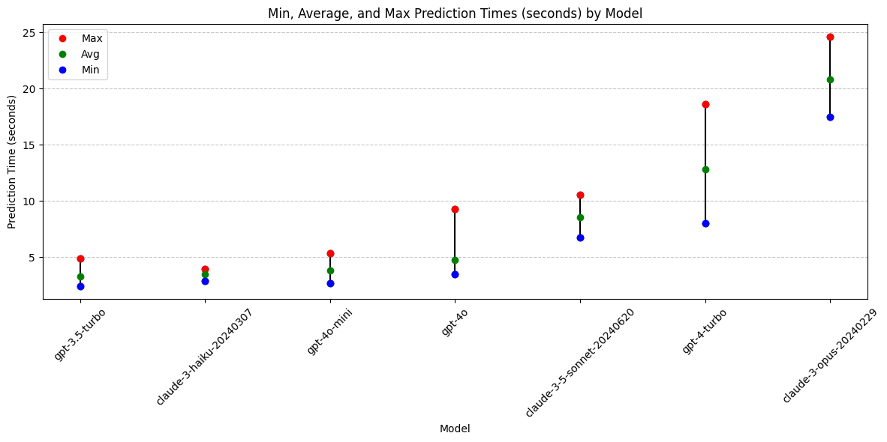

**Conclusions: Prediction Time**

- Claude-3-opus and gpt-4-turbo are highly variable and both take the longest.

Models with best prediction times:

- gpt-3.5-turbo
- claude-3-haiku (least variable)
- gpt-4o-mini

## **Analysis: Prediction Cost**

```python
avg_cost = df.groupby('model')['prediction_cost'].mean().reset_index(name='avg')

grouped_cost = df.groupby('model')['prediction_cost'].agg(['min', 'max']).reset_index()
grouped_cost = pd.merge(grouped_cost, avg_cost, left_on='model', right_on='model')

grouped_cost = grouped_cost.sort_values(by='avg', ascending=True)

print(grouped_cost)
```

                            model       min       max       avg
    6                 gpt-4o-mini  0.000318  0.000402  0.000358
    3               gpt-3.5-turbo  0.000847  0.001032  0.000936
    1     claude-3-haiku-20240307  0.000951  0.001081  0.001004
    5                      gpt-4o  0.008860  0.010990  0.009821
    0  claude-3-5-sonnet-20240620  0.012213  0.014403  0.013255
    4                 gpt-4-turbo  0.018320  0.022490  0.020131
    2      claude-3-opus-20240229  0.057090  0.072765  0.061650

```python
plt.figure(figsize=(12, 6))

for i, row in grouped_cost.iterrows():
    plt.plot([row['model'], row['model']], [row['min'], row['max']], color='black', linestyle='-', marker='o')
    plt.plot(row['model'], row['max'], 'ro', label='Max' if i == 0 else "")
    plt.plot(row['model'], row['avg'], 'go', label='Avg' if i == 0 else "")
    plt.plot(row['model'], row['min'], 'bo', label='Min' if i == 0 else "")

plt.xlabel('Model')
plt.ylabel('Prediction Cost $')
plt.title('Min, Average, and Max Prediction Costs ($) by Model')
plt.xticks(rotation=45)
plt.legend(loc='best')
plt.grid(axis='y', linestyle='--', alpha=0.7)

plt.tight_layout()
plt.show()
```

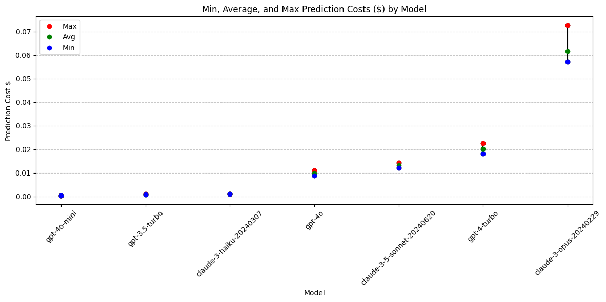

## **Analysis: Prediction Cost with Model Temperature**

What impact does changing the temperature have on cost?

Lower temp value = more deterministic output

Are more deterministic outputs more consistent in price range?

```python
# Calculate average cost, grouping by both model and temperature
avg_cost = df.groupby(['model', 'temperature'])['prediction_cost'].mean().reset_index(name='avg')

# Calculate min and max costs, grouping by both model and temperature
grouped_cost = df.groupby(['model', 'temperature'])['prediction_cost'].agg(['min', 'max']).reset_index()

# Merge the grouped cost with the average cost
grouped_cost = pd.merge(grouped_cost, avg_cost, on=['model', 'temperature'])

# Append temperature to the model name
grouped_cost['model'] = grouped_cost['model'] + ' (T=' + grouped_cost['temperature'].astype(str) + ')'

grouped_cost = grouped_cost.drop(columns = ['temperature'])

# Sort the DataFrame by avg cost in ascending order
grouped_cost = grouped_cost.sort_values(by='avg', ascending=True)

print(grouped_cost)

```

                                     model       min       max       avg
    13                 gpt-4o-mini (T=1.0)  0.000338  0.000402  0.000357
    12                 gpt-4o-mini (T=0.7)  0.000318  0.000396  0.000359
    7                gpt-3.5-turbo (T=1.0)  0.000847  0.001003  0.000934
    6                gpt-3.5-turbo (T=0.7)  0.000862  0.001032  0.000938
    2      claude-3-haiku-20240307 (T=0.7)  0.000951  0.001081  0.000995
    3      claude-3-haiku-20240307 (T=1.0)  0.000960  0.001058  0.001013
    10                      gpt-4o (T=0.7)  0.008860  0.010990  0.009725
    11                      gpt-4o (T=1.0)  0.009445  0.010720  0.009916
    1   claude-3-5-sonnet-20240620 (T=1.0)  0.012213  0.014403  0.013208
    0   claude-3-5-sonnet-20240620 (T=0.7)  0.012303  0.014178  0.013302
    9                  gpt-4-turbo (T=1.0)  0.018320  0.021290  0.020021
    8                  gpt-4-turbo (T=0.7)  0.018410  0.022490  0.020240
    5       claude-3-opus-20240229 (T=1.0)  0.057915  0.066465  0.061282
    4       claude-3-opus-20240229 (T=0.7)  0.057090  0.072765  0.062018

```python
plt.figure(figsize=(12, 6))

for i, row in grouped_cost.iterrows():
    plt.plot([row['model'], row['model']], [row['min'], row['max']], color='black', linestyle='-', marker='o')
    plt.plot(row['model'], row['max'], 'ro', label='Max' if i == 0 else "")
    plt.plot(row['model'], row['avg'], 'go', label='Avg' if i == 0 else "")
    plt.plot(row['model'], row['min'], 'bo', label='Min' if i == 0 else "")

plt.xlabel('Model')
plt.ylabel('Prediction Cost $')
plt.title('Min, Average, and Max Prediction Costs ($) by Model')
plt.xticks(rotation=90)
plt.legend(loc='best')
plt.grid(axis='y', linestyle='--', alpha=0.7)

plt.tight_layout()
plt.show()
```

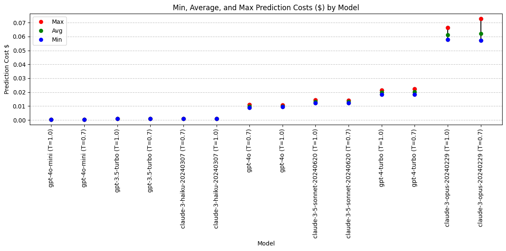

**Conclusions: Prediction Cost**

Adjusting the temperature from 1.0 to 0.7 does not lead to a significant or consistent change in prediction cost.

Running this analysis on the given models revealed what appears to be four different pricing tiers:

Lowest:

- gpt-4o-mini
- gpt-3.5-turbo
- claude-3-haiku

Medium:

- gpt-4o
- claude-3.5-sonnet

High:

- gpt-4-turbo

Highest:

- claude-3-opus

Cost conclusions:
Claude-3-opus is an outlier in high cost. Widest cost range (highly variable output length). A lower temperature means the output is more deterministic, but on this model the cost is even more varied at a temperarute of 0.7 than 1.0.

Models with best pricing:

- gpt-4o-mini
- gpt-3.5-turbo
- claude-3-haiku

## **Analysis: Output Tokens**

```python
avg_output_tokens = df.groupby('model')['output_tokens'].mean().reset_index(name='avg_output')

grouped_output = df.groupby('model')['output_tokens'].agg(['min', 'max']).reset_index()
grouped_output = pd.merge(grouped_output, avg_output_tokens, left_on='model', right_on='model')

grouped_output = grouped_output.sort_values(by='avg_output', ascending=True)

print(grouped_output)
```

```python
plt.figure(figsize=(12, 6))

for i, row in grouped_output.iterrows():
    plt.plot([row['model'], row['model']], [row['min'], row['max']], color='black', linestyle='-', marker='o')
    plt.plot(row['model'], row['max'], 'ro', label='Max' if i == 0 else "")
    plt.plot(row['model'], row['avg_output'], 'go', label='Avg' if i == 0 else "")
    plt.plot(row['model'], row['min'], 'bo', label='Min' if i == 0 else "")

plt.xlabel('Model')
plt.ylabel('Output Tokens')
plt.title('Min, Max, and Average Output Tokens by Model')
plt.xticks(rotation=45)
plt.legend(loc='best')
plt.grid(axis='y', linestyle='--', alpha=0.7)

plt.tight_layout()
plt.show()
```

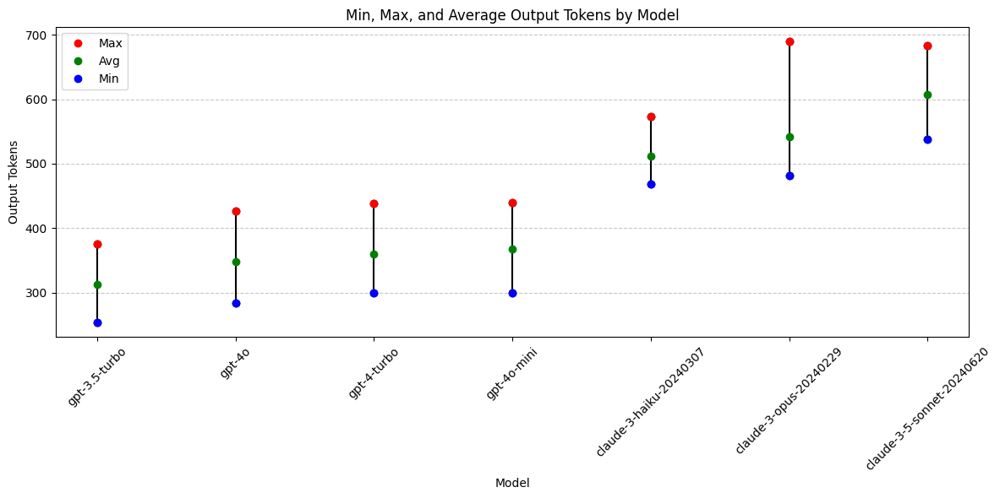

**Output Token with Model Temperature**

What impact does changing the temperature have on output tokens?

Lower temp value = more deterministic output

```python
avg_output_tokens = df.groupby(['model', 'temperature'])['output_tokens'].mean().reset_index(name='avg_output')

grouped_output = df.groupby(['model', 'temperature'])['output_tokens'].agg(['min', 'max']).reset_index()
grouped_output = pd.merge(grouped_output, avg_output_tokens, on=['model', 'temperature'])

grouped_output['model'] = grouped_output['model'] + ' (T=' + grouped_output['temperature'].astype(str) + ')'

grouped_output = grouped_output.drop(columns = ['temperature'])

grouped_output = grouped_output.sort_values(by='avg_output', ascending=True)

print(grouped_output)
```

                                     model  min  max  avg_output
    7                gpt-3.5-turbo (T=1.0)  253  357       311.2
    6                gpt-3.5-turbo (T=0.7)  263  376       313.5
    10                      gpt-4o (T=0.7)  284  426       341.7
    11                      gpt-4o (T=1.0)  323  408       354.4
    9                  gpt-4-turbo (T=1.0)  299  398       355.7
    8                  gpt-4-turbo (T=0.7)  302  438       363.0
    13                 gpt-4o-mini (T=1.0)  334  440       365.7
    12                 gpt-4o-mini (T=0.7)  300  430       368.7
    2      claude-3-haiku-20240307 (T=0.7)  469  573       504.0
    3      claude-3-haiku-20240307 (T=1.0)  476  554       518.2
    5       claude-3-opus-20240229 (T=1.0)  492  606       536.9
    4       claude-3-opus-20240229 (T=0.7)  481  690       546.7
    1   claude-3-5-sonnet-20240620 (T=1.0)  538  684       604.3
    0   claude-3-5-sonnet-20240620 (T=0.7)  544  669       610.6

```python
plt.figure(figsize=(12, 6))

for i, row in grouped_output.iterrows():
    plt.plot([row['model'], row['model']], [row['min'], row['max']], color='black', linestyle='-', marker='o')
    plt.plot(row['model'], row['max'], 'ro', label='Max' if i == 0 else "")
    plt.plot(row['model'], row['avg_output'], 'go', label='Avg' if i == 0 else "")
    plt.plot(row['model'], row['min'], 'bo', label='Min' if i == 0 else "")

plt.xlabel('Model')
plt.ylabel('Output Tokens')
plt.title('Min, Max, and Average Output Tokens by Model')
plt.xticks(rotation=90)
plt.legend(loc='best')
plt.grid(axis='y', linestyle='--', alpha=0.7)

plt.tight_layout()
plt.show()
```

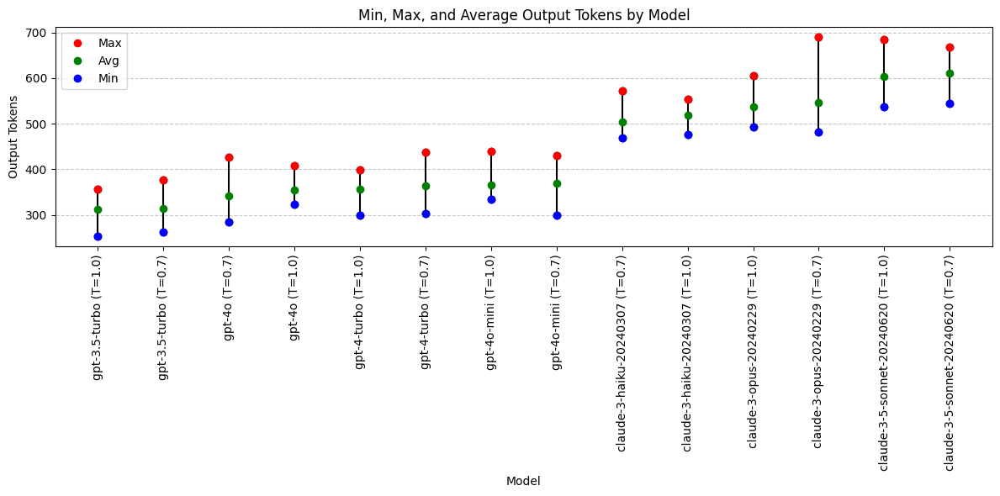

**Output Token Conclusions**

- Anthropic Claude models are all more verbose than OpenAI gpt models (given exact same prompt and JSON schema).
- Changing temperature does not have clear impact on output token length
- Why are Anthropic outputs longer? Inclusion of differential diagnosis or other content field?

Models with output token preference:

- Not applicable. Longer/shorter is not necessarily better.

## **Analysis: Inclusion of Differential Diagnosis with Alternative Treatment**

- Was a Differential Diagnosis returned?
- How many Differential Diagnosis values included "alternative treatments" as requested in the system prompt?

```python
# Function to calculate the length of differential diagnosis or zero if empty
def diagnosis_length(diagnosis: str):
    return len(diagnosis) if diagnosis else 0
```

```python
df['differential_diagnosis'] = df['differential_diagnosis'].fillna('')

# Add a new column for the length of differential diagnosis
df['diff_diag_length'] = df['differential_diagnosis'].apply(diagnosis_length)

# Count the number of rows with a non-empty differential diagnosis
df['has_diff_diag'] = df['differential_diagnosis'].apply(lambda x: 1 if x else 0)

# Check if 'alternative' is in the differential diagnosis
df['has_alternative'] = df['differential_diagnosis'].apply(lambda x: 1 if 'alternative' in x.lower() else 0)

# Calculate the average length of differential diagnosis
avg_diff_length = df.groupby(['model', 'temperature'])['diff_diag_length'].mean().reset_index(name='avg_diff_length')

# Count the number of rows with a non-empty differential diagnosis
total_diff_diag = df.groupby(['model', 'temperature'])['has_diff_diag'].sum().reset_index(name='total_diff_diag')

# Count the number of rows with 'alternative' in the differential diagnosis
total_alternative = df.groupby(['model', 'temperature'])['has_alternative'].sum().reset_index(name='total_alternative')

# Merge the results
grouped_output = pd.merge(avg_diff_length, total_diff_diag, on=['model', 'temperature'])
grouped_output = pd.merge(grouped_output, total_alternative, on=['model', 'temperature'])

# Append temperature to the model name
grouped_output['model'] = grouped_output['model'] + ' (T=' + grouped_output['temperature'].astype(str) + ')'

# Drop the temperature column
grouped_output = grouped_output.drop(columns=['temperature'])

# Sort the DataFrame by avg_diff_length in ascending order
grouped_output = grouped_output.sort_values(by='avg_diff_length', ascending=True)

print(grouped_output)
```

                                     model  avg_diff_length  total_diff_diag  \
    10                      gpt-4o (T=0.7)            143.6               10
    0   claude-3-5-sonnet-20240620 (T=0.7)            150.5               10
    11                      gpt-4o (T=1.0)            158.0               10
    2      claude-3-haiku-20240307 (T=0.7)            165.2               10
    6                gpt-3.5-turbo (T=0.7)            175.5                8
    3      claude-3-haiku-20240307 (T=1.0)            216.1               10
    7                gpt-3.5-turbo (T=1.0)            218.4                9
    12                 gpt-4o-mini (T=0.7)            219.1               10
    4       claude-3-opus-20240229 (T=0.7)            222.3               10
    5       claude-3-opus-20240229 (T=1.0)            223.9               10
    13                 gpt-4o-mini (T=1.0)            236.6               10
    1   claude-3-5-sonnet-20240620 (T=1.0)            251.7               10
    8                  gpt-4-turbo (T=0.7)            260.4               10
    9                  gpt-4-turbo (T=1.0)            261.7               10

        total_alternative
    10                  4
    0                   1
    11                  2
    2                   3
    6                   3
    3                   2
    7                   5
    12                  8
    4                   3
    5                   5
    13                  9
    1                   3
    8                   9
    9                   4

```python

# Plotting the data
fig, ax1 = plt.subplots(figsize=(12, 8))

# Bar chart for total differentials
bar1 = ax1.bar(grouped_output['model'], grouped_output['total_diff_diag'], label='Total Differential Diagnoses Returned', color='skyblue', edgecolor='skyblue')

# Bar chart for differentials that include "alternative"
bar2 = ax1.bar(grouped_output['model'], grouped_output['total_alternative'], label='Differentials included alternative treatment', color='lightcoral')

# Secondary y-axis for average differential diagnosis length
ax2 = ax1.twinx()
ax2.plot(grouped_output['model'], grouped_output['avg_diff_length'], color='green', marker='o', linestyle='', linewidth=2, markersize=8, label='Average Differential Diagnosis Length')

# Customizing the plot
ax1.set_xlabel('Model (Temperature)')
ax1.set_ylabel('Number of Differential Diagnoses Returned')
ax2.set_ylabel('Average Differential Diagnosis Length (characters)')
ax1.set_title('Inclusion of Differential Diagnosis by Model and Temperature')
ax1.set_xticks(range(len(grouped_output['model'])))
ax1.set_xticklabels(grouped_output['model'], rotation=45, ha='right')
ax1.legend(loc='upper left', bbox_to_anchor=(0.0, 1.15), ncol=2)
ax2.legend(loc='upper right', bbox_to_anchor=(1.0, 1.15), ncol=1)
ax1.grid(axis='y', linestyle='--', alpha=0.7)

# Display the plot
plt.tight_layout()
plt.show()
```

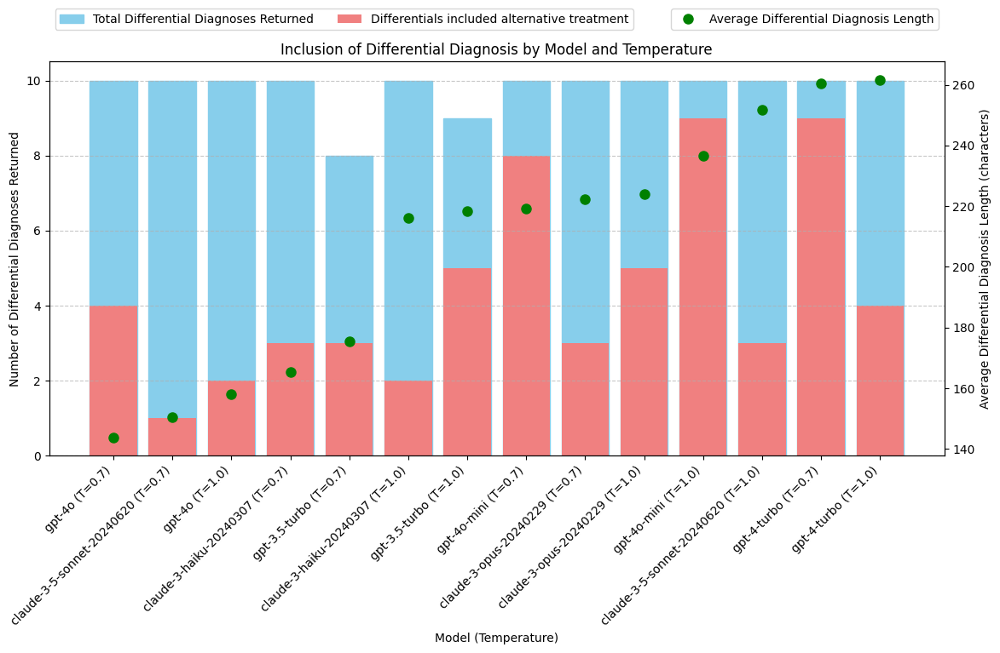

**Conclusions: Inclusion of Differential Diagnosis with Alternative Treatment**

- Results are highly varied across models. Difficult to draw conclusions about model capabilities. gpt-4-turbo may be better at writing a detailed differential diagnosis, but how would the other models perform if asked to do this task with more specific detail? gpt-4o-mini may be better at following system prompt instructions and including an alternative treatment, but how would the other models perform if this requirement was made more explicit?
- While Claude models tend to return more total output tokens, this is not solely due to greater length or frequency of including a differential diagnosis.
- Update system prompt and JSON schema to better direct all models to include Differential Diagnosis with alternative treatment options.

## **Analysis: Fixing Transcription Errors**

The transcript includes the text "Vicodin 5-3, 25 milligrams" for when the speaker said "Vicodin five slash three twenty-five milligrams." This should have been transcribed as "Vicodin 5/325 milligrams."

The dosage of medications is typically written with a slash ("/") to clearly separate the amounts of each ingredient. "5" represents the amount of hydrocodone (usually in milligrams), and "325" represents the amount of acetaminophen (also in milligrams).
"Vicodin 5/325" means each tablet contains 5 mg of hydrocodone and 325 mg of acetaminophen.

The transcript also includes a spelling error related to a medication name: "flexor all 20 milligram tablets" should be "Flexeril 20 milligram tablets".

While this was not specifically requested in the prompt, some of the models caught these mistakes in the transcript and automatically fixed them in the response.

```python
# Function to calculate whether the soap_plan includes the text 5/325
def check_formatting(soap_plan: str):
    return 1 if "5/325" in soap_plan else 0
```

```python
# Function to calculate whether the soap_plan includes the text flexeril
def check_spelling(soap_plan: str):
    return 1 if "flexeril" in soap_plan.lower() else 0
```

```python
# Add a new column to store whether soap_plan includes corrrect formatting of 5/325
df['corrected_formatting'] = df['soap_plan'].apply(check_formatting)

# Add a new column to store whether soap_plan includes corrected spelling of flexeril
df['corrected_spelling'] = df['soap_plan'].apply(check_spelling)

# Count the number of rows with correct formatting
total_formatted = df.groupby(['model', 'temperature'])['corrected_formatting'].sum().reset_index(name='total_formatted')

# Count the number of rows with correct spelling
total_spelling = df.groupby(['model', 'temperature'])['corrected_spelling'].sum().reset_index(name='total_spelling')

# Merge the results ()
grouped_output = pd.merge(total_formatted, total_spelling, on=['model', 'temperature'], how='inner')

# Append temperature to the model name
grouped_output['model'] = grouped_output['model'] + ' (T=' + grouped_output['temperature'].astype(str) + ')'

# Drop the temperature column
grouped_output = grouped_output.drop(columns=['temperature'])

# Sort the DataFrame by total_formatted in ascending order
grouped_output = grouped_output.sort_values(by='total_formatted', ascending=True)

print(grouped_output)
```

                                     model  total_formatted  total_spelling
    0   claude-3-5-sonnet-20240620 (T=0.7)                0              10
    1   claude-3-5-sonnet-20240620 (T=1.0)                0              10
    2      claude-3-haiku-20240307 (T=0.7)                0              10
    6                gpt-3.5-turbo (T=0.7)                0               3
    8                  gpt-4-turbo (T=0.7)                0               4
    12                 gpt-4o-mini (T=0.7)                0              10
    13                 gpt-4o-mini (T=1.0)                0              10
    7                gpt-3.5-turbo (T=1.0)                1               4
    9                  gpt-4-turbo (T=1.0)                2               5
    3      claude-3-haiku-20240307 (T=1.0)                3              10
    4       claude-3-opus-20240229 (T=0.7)                3              10
    5       claude-3-opus-20240229 (T=1.0)                3              10
    11                      gpt-4o (T=1.0)                7              10
    10                      gpt-4o (T=0.7)                9              10

```python

# Plotting the data
fig, ax1 = plt.subplots(figsize=(12, 8))

bar_width = 0.35
opacity = 0.8

# Bar chart for total corrected values
bar1 = ax1.bar(grouped_output['model'], grouped_output['total_formatted'], width=bar_width, label='Corrected Medication Formatting', color='skyblue', edgecolor='skyblue')
bar2 = ax1.bar([x + bar_width for x in range(len(grouped_output['model']))], grouped_output['total_spelling'], width=bar_width, label='Corrected Medication Spelling', color='lightcoral')

# Customizing the plot
ax1.set_xlabel('Model (Temperature)')
ax1.set_ylabel('Number of Corrections Made')
ax1.set_title('Correction of Transcription Errors')
ax1.set_xticks(range(len(grouped_output['model'])))
ax1.set_xticklabels(grouped_output['model'], rotation=90, ha='right')
ax1.legend(loc='upper left', bbox_to_anchor=(0.0, 1.15), ncol=2)
ax1.grid(axis='y', linestyle='--', alpha=0.7)

# Display the plot
plt.tight_layout()
plt.show()
```

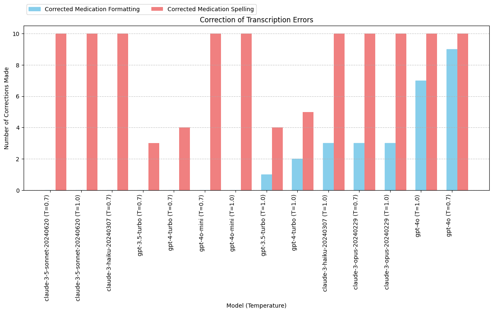

**Conclusions: Fixing Transcription Errore**

- Results are highly varied across models. Difficult to draw conclusions about model capabilities. gpt-4o may be better at fixing transcriptions errors but this behavior was not specifically requested.
- Changing the temperature between 0.7 and 1.0 does not appear to have a direct impact on transcription error correction outcomes.
- Update system prompt and JSON schema to specifically request fixing medication transcription errors.

# **PROMPT REVISION**

- Update system_prompt and JSON_schema: Response MUST include Differential Diagnosis with an alternative treatment plan.
- Update system_prompt and JSON_schema: Transcripts are likely to include errors. Specify that you want the model to fix prescription names and formatting.

- Set minimum length for each response field to ensure longer responses? Could have negative consequences. Will this force the model to make something up if the information is not in the transcript? Decide to pass on this for now.

- Drop claude-3-opus: expensive.

Update JSON schema:

```python
JSON_schema_obj = {
          "type": "object",
          "properties": {
            "appointment_date": {
              "type": "string",
              "format": "date",
              "pattern": "^\\d{4}-\\d{2}-\\d{2}$",
              "description": "Date of the appointment in yyyy-mm-dd format"
            },
            "appointment_time": {
              "type": "string",
              "pattern": "^\\d{2}:\\d{2}$",
              "description": "Time of the appointment in hh:mm format"
            },
            "chief_complaint": {
              "type": "string",
              "description": "Chief complaint. Capitalize the first letter of the string"
            },
            "soap_subjective": {
              "type": "string",
              "minLength": 550,
              "description": "Subjective information from the patient. DO NOT include patient name or date of birth."
            },
            "soap_objective": {
              "type": "string",
              "minLength": 100,
              "description": "Objective observations and measurements. Narrative format or UNORDERED list. DO NOT include patient name or date of birth."
            },
            "soap_assessment": {
              "type": "string",
              "description": "Assessment and diagnosis. Narrative format or UNORDERED list. NO DIFFERENTIAL DIAGNOSIS in this field."
            },
            "soap_plan": {
              "type": "string",
              "minLength": 250,
              "description": "Plan for treatment and patient education. Narrative format or UNORDERED list. Be sure to correct spelling and formatting of medications."
            },
            "differential_diagnosis": {
              "type": "string",
              "minLength": 140,
              "description": "Differential diagnosis and alternative treatment plan. Narrative format or UNORDERED list. ALWAYS INCLUDE."
            },
            "patient_location": {
              "type": "string",
              "description": "Location of the patient (State/Province, e.g., 'Arizona'). Only include this key if the patient location is clearly mentioned in the transcript."
            }
          }
        }
```

Update system content string to specify differential diagnosis will be generated; medication spelling and formatting may need to be corrected:

```python
system_content_string = """
As a highly skilled medical assistant, your task is to meticulously review the provided TRANSCRIPT and craft a clinical SOAP note in the form of a JSON object. Please adhere strictly to the following guidelines:
- Ensure all lists within the SOAP note are unordered, formatted with a simple dash (-). Avoid using numbered lists.
- Incorporate as much detailed information as possible from the transcript into the SOAP note. Thoroughness is key!
- If certain information required for any fields is missing from the transcript, exclude those fields from the JSON object entirely. Do not include fields with empty strings or "unknown" values.
- The transcript may not explicitly mention differential diagnoses. As an expert, you are expected to formulate a differential diagnosis based on the transcript information. Always include a differential diagnosis along with alternative treatment recommendations in your SOAP note.
- Be vigilant for formatting and spelling errors in the transcript, particularly regarding prescription medications. Correct these errors accurately. Pay special attention to the spelling and formatting of any prescription medications mentioned.
Your expertise and attention to detail will ensure the generation of a comprehensive and accurate SOAP note.
"""
```

Create a new param to track prompt version updates:

```python
prompt_version = 2
```

```python
openai_models = ['gpt-3.5-turbo', 'gpt-4-turbo', 'gpt-4o', 'gpt-4o-mini']
```

```python
openai_temperatures = [1, 0.7]
```

Drop Anthropic Claude model:

```python
anthropic_models = ['claude-3-haiku-20240307', 'claude-3-5-sonnet-20240620']
```

```python
anthropic_temperatures = [1, 0.7]
```

```python
iterations = 10
```

Update OpenAI API call function to take prompt_version param:

```python
def get_analysis_openai(system_content_string: str, user_content_string: str, model: str, temperature: float = 1.0, prompt_version: int = 1):
    print(f"calling get_analysis_openai with model: {model}")
    start_time = time.time()

    try:
        response = openai.chat.completions.create(
            model=model,
            messages=[
                {"role": "system", "content": system_content_string},
                {"role": "user", "content": user_content_string},
            ],
            temperature=temperature,
            response_format={"type": "json_object"},
            tools=[{
                "type": "function",
                "function": {
                    "name": "JSON_soap_note",
                    "description":"Clinical SOAP note as a JSON object",
                    "parameters": JSON_schema_obj
                }
            }],
            tool_choice={"type": "function", "function": {"name": "JSON_soap_note"}},
        )

        completion_string = response.choices[0].message.tool_calls[0].function.arguments
        usage = response.usage

        input_tokens = usage.prompt_tokens
        output_tokens = usage.completion_tokens
        pricing = model_pricing[model]
        input_cost = pricing['input_token_cost']
        output_cost = pricing['output_token_cost']

        prediction_cost = ((input_tokens / 1000 * input_cost) + (output_tokens / 1000 * output_cost))
        prediction_time = time.time() - start_time


        response_data = {
            'model': model,
            'temperature': temperature,
            'input_tokens': input_tokens,
            'output_tokens': output_tokens,
            'input_cost': input_cost,
            'output_cost': output_cost,
            'prediction_cost': prediction_cost,
            'prediction_time': prediction_time,
            'completion_string': completion_string,
            'prompt_version': prompt_version
        }

        # Parse completion string
        try:
            completion_data = json.loads(completion_string)
            response_data.update(completion_data)
        except json.JSONDecodeError:
            pass

        return response_data

    except Exception as e:
        print("Error getting OpenAI completion data:", e)
        return {'error': str(e)}
```

```python
model='gpt-4o-mini'
temperature = 1
prompt_version = 2
result = get_analysis_openai(system_content_string, user_content_string, model, temperature, prompt_version)
print(result)

```

    calling get_analysis_openai with model: gpt-4o-mini
    {'model': 'gpt-4o-mini', 'temperature': 1, 'input_tokens': 1016, 'output_tokens': 652, 'input_cost': 0.00015, 'output_cost': 0.0006, 'prediction_cost': 0.0005436, 'prediction_time': 11.347606897354126, 'completion_string': '{"appointment_date":"2024-07-24","appointment_time":"15:36","chief_complaint":"Low back pain","soap_subjective":"Josephina Martina is a however-year-old female presenting with complaints of low back pain primarily associated with left-sided sciatica that has been ongoing since November. She reports that while she has been undergoing physical therapy, which initially improved her condition, her pain has recently worsened. The patient describes the pain as constant and radiating down her left leg. Importantly, she denies any alarming symptoms such as saddle anesthesia, loss of bowel or bladder control, and reports no weakness in her extremities. No history of abdominal pain, dysuria, or hematuria is noted. Josephina has no known drug allergies and is generally healthy, aside from her history of migraine headaches for which she is currently taking tenazidine. She is seeking treatment for this acute flare-up of sciatica until she can consult her primary care physician.","soap_objective":"- Patient appears in no acute distress but displays discomfort when addressing her back pain. \\n- Physical examination reveals tenderness in the lumbar region, particularly on the left side. \\n- Range of motion in the lower back is limited due to pain. \\n- Neurological examination indicates intact strength and sensation in both lower extremities, with straight leg raise testing positive for sciatic pain on the left side. \\n- No signs of dermatome loss or significant neurological deficits observed during examination.","soap_assessment":"Josephina is diagnosed with acute lumbar radiculopathy with left-sided sciatica as evidenced by her reported symptoms and objective findings during the examination. There are no signs of serious underlying conditions; however, the potential for a ruptured disc, nerve impingement, or degenerative disc disease has been recognized necessitating further imaging.","soap_plan":"The treatment plan includes a Medrol Dose Pack to manage inflammation and relieve pain; prescription to be dispensed per pharmacist with no refills. Additionally, Flexeril (cyclobenzaprine) 20 mg tablets are prescribed, with directions to take one by mouth as needed for muscle spasms. Pain management will also include Vicodin (hydrocodone/acetaminophen) 5-325 mg; the patient is to take one to two tablets by mouth every four to six hours as needed for pain, with a dispense quantity of 20 and no refills. The patient is also advised to arrange for an MRI of the lumbar spine to assess for any possible ruptured disk or other significant issues.","differential_diagnosis":"- Herniated lumbar disc: Given the radicular symptoms and history of worsening pain, this should be closely evaluated by MRI.\\n- Degenerative disc disease: Age-related changes could contribute to the patient’s sciatica.\\n- Lumbar spine stenosis: The possibility of narrowing in the spinal canal could be considered as a cause for her symptoms.\\n- Radiculopathy due to non-discal processes: Other sources such as piriformis syndrome or muscle strain may also cause similar presentations. \\n- Alternative treatment options include acupuncture, chiropractic care, or continued physical therapy emphasizing stretching and strengthening exercises.","patient_location":"unknown"}', 'prompt_version': 2, 'appointment_date': '2024-07-24', 'appointment_time': '15:36', 'chief_complaint': 'Low back pain', 'soap_subjective': 'Josephina Martina is a however-year-old female presenting with complaints of low back pain primarily associated with left-sided sciatica that has been ongoing since November. She reports that while she has been undergoing physical therapy, which initially improved her condition, her pain has recently worsened. The patient describes the pain as constant and radiating down her left leg. Importantly, she denies any alarming symptoms such as saddle anesthesia, loss of bowel or bladder control, and reports no weakness in her extremities. No history of abdominal pain, dysuria, or hematuria is noted. Josephina has no known drug allergies and is generally healthy, aside from her history of migraine headaches for which she is currently taking tenazidine. She is seeking treatment for this acute flare-up of sciatica until she can consult her primary care physician.', 'soap_objective': '- Patient appears in no acute distress but displays discomfort when addressing her back pain. \n- Physical examination reveals tenderness in the lumbar region, particularly on the left side. \n- Range of motion in the lower back is limited due to pain. \n- Neurological examination indicates intact strength and sensation in both lower extremities, with straight leg raise testing positive for sciatic pain on the left side. \n- No signs of dermatome loss or significant neurological deficits observed during examination.', 'soap_assessment': 'Josephina is diagnosed with acute lumbar radiculopathy with left-sided sciatica as evidenced by her reported symptoms and objective findings during the examination. There are no signs of serious underlying conditions; however, the potential for a ruptured disc, nerve impingement, or degenerative disc disease has been recognized necessitating further imaging.', 'soap_plan': 'The treatment plan includes a Medrol Dose Pack to manage inflammation and relieve pain; prescription to be dispensed per pharmacist with no refills. Additionally, Flexeril (cyclobenzaprine) 20 mg tablets are prescribed, with directions to take one by mouth as needed for muscle spasms. Pain management will also include Vicodin (hydrocodone/acetaminophen) 5-325 mg; the patient is to take one to two tablets by mouth every four to six hours as needed for pain, with a dispense quantity of 20 and no refills. The patient is also advised to arrange for an MRI of the lumbar spine to assess for any possible ruptured disk or other significant issues.', 'differential_diagnosis': '- Herniated lumbar disc: Given the radicular symptoms and history of worsening pain, this should be closely evaluated by MRI.\n- Degenerative disc disease: Age-related changes could contribute to the patient’s sciatica.\n- Lumbar spine stenosis: The possibility of narrowing in the spinal canal could be considered as a cause for her symptoms.\n- Radiculopathy due to non-discal processes: Other sources such as piriformis syndrome or muscle strain may also cause similar presentations. \n- Alternative treatment options include acupuncture, chiropractic care, or continued physical therapy emphasizing stretching and strengthening exercises.', 'patient_location': 'unknown'}

Update Anthropic API call function to take prompt_version param:

```python
def get_analysis_anthropic(system_content_string: str, user_content_string: str, model: str, temperature: float = 1.0, prompt_version: int = 1):
    print(f"calling get_analysis_anthropic with model: {model}")
    start_time = time.time()

    try:
        response = anthropic.messages.create(
            model=model,
            messages=[
                {"role": "user", "content": user_content_string},
            ],
            temperature=temperature,
            system=system_content_string,
            max_tokens=4096,
            tool_choice={"type": "tool", "name":"JSON_soap_note"},
            tools=[{
                "name": "JSON_soap_note",
                "description":"Clinical SOAP note as a JSON object",
                "input_schema": JSON_schema_obj
                }]
        )

        tool_use_block = response.content[0]

        soap_note = tool_use_block.input

        usage = response.usage
        input_tokens = usage.input_tokens
        output_tokens = usage.output_tokens
        pricing = model_pricing[model]
        input_cost = pricing['input_token_cost']
        output_cost = pricing['output_token_cost']

        prediction_cost = ((input_tokens / 1000 * input_cost) + (output_tokens / 1000 * output_cost))
        prediction_time = time.time() - start_time


        response_data = {
            'model': model,
            'temperature': temperature,
            'input_tokens': input_tokens,
            'output_tokens': output_tokens,
            'input_cost': input_cost,
            'output_cost': output_cost,
            'prediction_cost': prediction_cost,
            'prediction_time': prediction_time,
            'completion_string': json.dumps(soap_note),
            'prompt_version': prompt_version
        }

        response_data.update(soap_note)


        return response_data

    except Exception as e:
        print("Error getting Anthropic completion data:", e)
        return {'error': str(e)}
```

```python
model = 'claude-3-haiku-20240307'
temperature = 1

result = get_analysis_anthropic(system_content_string, user_content_string, model, temperature, prompt_version)

print(result)
```

    calling get_analysis_anthropic with model: claude-3-haiku-20240307
    {'model': 'claude-3-haiku-20240307', 'temperature': 1, 'input_tokens': 1565, 'output_tokens': 551, 'input_cost': 0.00025, 'output_cost': 0.00125, 'prediction_cost': 0.00108, 'prediction_time': 3.8441195487976074, 'completion_string': '{"appointment_date": "2024-07-24", "appointment_time": "15:36", "chief_complaint": "Low back pain", "soap_subjective": "Josephina Martina, a 53-year-old female, presented with complaints of left-sided sciatic pain radiating down her left leg since November. She states she has been undergoing physical therapy which helped, but the pain has recently worsened, causing constant pain. She denies any red flags such as saddle anesthesia, loss of urine or bowel control, and weakness in the extremity.", "soap_objective": "No further objective observations or measurements were provided in the transcript.", "soap_assessment": "Based on the patient\'s symptomatology and the fact that she is young and otherwise healthy, the assessment is acute lumbar radiculopathy/sciatica.", "differential_diagnosis": "- Lumbar disc herniation\\n- Lumbar spinal stenosis\\n- Degenerative disc disease\\nThe patient should undergo an MRI of the lumbar spine to evaluate for the underlying cause of the sciatica, such as a ruptured disc, nerve impingement, or degenerative disc disease. If imaging is unremarkable, conservative management with physical therapy and medications may be sufficient.", "soap_plan": "1. Prescribed a medrol dose pack to be dispensed per pharmacist, no refill.\\n2. Prescribed Flexeril 20 mg, 1 tablet by mouth twice daily as needed for muscle spasm.\\n3. Prescribed Vicodin 5-325 mg, 1-2 tablets every 4-6 hours as needed for pain, dispense 20, no refill.\\n4. Recommended the patient undergo an MRI of the lumbar spine to evaluate for the underlying cause of the sciatica, such as a ruptured disc, nerve impingement, or degenerative disc disease.\\n5. Advised the patient to follow up with her primary care provider for further management."}', 'appointment_date': '2024-07-24', 'appointment_time': '15:36', 'chief_complaint': 'Low back pain', 'soap_subjective': 'Josephina Martina, a 53-year-old female, presented with complaints of left-sided sciatic pain radiating down her left leg since November. She states she has been undergoing physical therapy which helped, but the pain has recently worsened, causing constant pain. She denies any red flags such as saddle anesthesia, loss of urine or bowel control, and weakness in the extremity.', 'soap_objective': 'No further objective observations or measurements were provided in the transcript.', 'soap_assessment': "Based on the patient's symptomatology and the fact that she is young and otherwise healthy, the assessment is acute lumbar radiculopathy/sciatica.", 'differential_diagnosis': '- Lumbar disc herniation\n- Lumbar spinal stenosis\n- Degenerative disc disease\nThe patient should undergo an MRI of the lumbar spine to evaluate for the underlying cause of the sciatica, such as a ruptured disc, nerve impingement, or degenerative disc disease. If imaging is unremarkable, conservative management with physical therapy and medications may be sufficient.', 'soap_plan': '1. Prescribed a medrol dose pack to be dispensed per pharmacist, no refill.\n2. Prescribed Flexeril 20 mg, 1 tablet by mouth twice daily as needed for muscle spasm.\n3. Prescribed Vicodin 5-325 mg, 1-2 tablets every 4-6 hours as needed for pain, dispense 20, no refill.\n4. Recommended the patient undergo an MRI of the lumbar spine to evaluate for the underlying cause of the sciatica, such as a ruptured disc, nerve impingement, or degenerative disc disease.\n5. Advised the patient to follow up with her primary care provider for further management.'}

```python
results_anthropic = []

for model in anthropic_models:
    for temperature in anthropic_temperatures:
        for _ in range(iterations):
            result = get_analysis_anthropic(system_content_string, user_content_string, model, temperature, prompt_version)
            if result:
                results_anthropic.append(result)

# Convert results to a DataFrame
df_results_anthropic = pd.DataFrame(results_anthropic)

# Save to csv
if os.path.exists('results-anthropic.csv'):
    df_results_anthropic.to_csv('results-anthropic.csv', mode='a', header=False, index=False)
else:
    df_results_anthropic.to_csv('results-anthropic.csv', index=False)
```

```python
results_openai = []

for model in openai_models:
    for temperature in openai_temperatures:
        for _ in range(iterations):
            result = get_analysis_openai(system_content_string, user_content_string, model, temperature, prompt_version)
            if result:
                results_openai.append(result)

# Convert results to a DataFrame
df_results_openai = pd.DataFrame(results_openai)

# Save to csv
if os.path.exists('results-openai.csv'):
    df_results_openai.to_csv('results-openai.csv', mode='a', header=False, index=False)
else:
    df_results_openai.to_csv('results-openai.csv', index=False)

```

## **RESULTS ANALYSIS WITH UPDATED PROMPT**

```python
from google.colab import drive
drive.mount('/content/drive')

df = pd.read_csv('/content/drive/MyDrive/soapnotescribe/combined-results-prompt-update.csv')
```

## **Analysis: Prediction Time**

```python
# Exclude claude-3-opus model
df = df.loc[df['model'] != 'claude-3-opus-20240229']

avg_time = df.groupby('model')['prediction_time'].mean().reset_index(name='avg_time')

grouped_time = df.groupby('model')['prediction_time'].agg(['min', 'max']).reset_index()
grouped_time = pd.merge(grouped_time, avg_time, left_on='model', right_on='model')

grouped_time = grouped_time.sort_values(by='avg_time', ascending=True)

print(grouped_time)
```

                            model       min        max   avg_time
    1     claude-3-haiku-20240307  2.904863   5.339926   3.794493
    2               gpt-3.5-turbo  2.403372   5.995300   4.075451
    4                      gpt-4o  3.496561  14.169378   6.490782
    5                 gpt-4o-mini  2.723844  14.743062   6.679159
    0  claude-3-5-sonnet-20240620  6.731199  18.393558  12.348582
    3                 gpt-4-turbo  8.035556  20.452861  13.798264

```python
plt.figure(figsize=(12, 6))

for i, row in grouped_time.iterrows():
    plt.plot([row['model'], row['model']], [row['min'], row['max']], color='black', linestyle='-', marker='o')
    plt.plot(row['model'], row['max'], 'ro', label='Max' if i == 0 else "")
    plt.plot(row['model'], row['avg_time'], 'go', label='Avg' if i == 0 else "")
    plt.plot(row['model'], row['min'], 'bo', label='Min' if i == 0 else "")

plt.xlabel('Model')
plt.ylabel('Prediction Time (seconds)')
plt.title('Min, Average, and Max Prediction Times (seconds) by Model')
plt.xticks(rotation=45)
plt.legend(loc='best')
plt.grid(axis='y', linestyle='--', alpha=0.7)

plt.tight_layout()
plt.show()
```

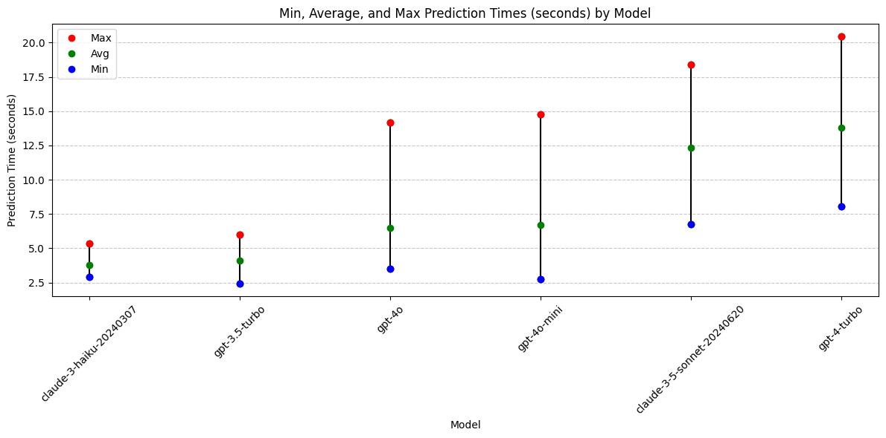

## **Conclusions: Prediction Time**

- Fastest and Most Consistent Response Times: The models Claude-3-Haiku and gpt-3.5-turbo offer the quickest and most consistent response times.
- **Performance Decline**: gpt-4o-mini is no longer among the top performers for speed or consistency in predictions.

Top Models for Prediction Speed and Consistency:

- gpt-3.5-turbo
- Claude-3-Haiku

## **Analysis: Prediction Cost with Updated Prompt**

What impact does the new prompt have on cost?

```python
# Exclude claude-3-opus model
df = df.loc[df['model'] != 'claude-3-opus-20240229']

# Calculate average cost, grouping by both model and prompt_version
avg_cost = df.groupby(['model', 'prompt_version'])['prediction_cost'].mean().reset_index(name='avg')

# Calculate min and max costs, grouping by both model and prompt_version
grouped_cost = df.groupby(['model', 'prompt_version'])['prediction_cost'].agg(['min', 'max']).reset_index()

# Merge the grouped cost with the average cost
grouped_cost = pd.merge(grouped_cost, avg_cost, on=['model', 'prompt_version'])

# Append prompt_version to the model name
grouped_cost['model'] = grouped_cost['model'] + ' (V=' + grouped_cost['prompt_version'].astype(str) + ')'

grouped_cost = grouped_cost.drop(columns = ['prompt_version'])

# Sort the DataFrame by avg cost in ascending order
grouped_cost = grouped_cost.sort_values(by='avg', ascending=True)

print(grouped_cost)

```

                                   model       min       max       avg
    10                 gpt-4o-mini (V=1)  0.000318  0.000402  0.000358
    11                 gpt-4o-mini (V=2)  0.000435  0.000607  0.000486
    4                gpt-3.5-turbo (V=1)  0.000847  0.001032  0.000936
    2      claude-3-haiku-20240307 (V=1)  0.000951  0.001081  0.001004
    5                gpt-3.5-turbo (V=2)  0.000937  0.001129  0.001040
    3      claude-3-haiku-20240307 (V=2)  0.000946  0.001259  0.001130
    8                       gpt-4o (V=1)  0.008860  0.010990  0.009821
    9                       gpt-4o (V=2)  0.010390  0.012520  0.011434
    0   claude-3-5-sonnet-20240620 (V=1)  0.012213  0.014403  0.013255
    1   claude-3-5-sonnet-20240620 (V=2)  0.017073  0.022578  0.019639
    6                  gpt-4-turbo (V=1)  0.018320  0.022490  0.020131
    7                  gpt-4-turbo (V=2)  0.019070  0.024710  0.021710

```python
plt.figure(figsize=(12, 6))

for i, row in grouped_cost.iterrows():
    plt.plot([row['model'], row['model']], [row['min'], row['max']], color='black', linestyle='-', marker='o')
    plt.plot(row['model'], row['max'], 'ro', label='Max' if i == 0 else "")
    plt.plot(row['model'], row['avg'], 'go', label='Avg' if i == 0 else "")
    plt.plot(row['model'], row['min'], 'bo', label='Min' if i == 0 else "")

plt.xlabel('Model')
plt.ylabel('Prediction Cost $')
plt.title('Min, Average, and Max Prediction Costs ($) by Model')
plt.xticks(rotation=90)
plt.legend(loc='best')
plt.grid(axis='y', linestyle='--', alpha=0.7)

plt.tight_layout()
plt.show()
```

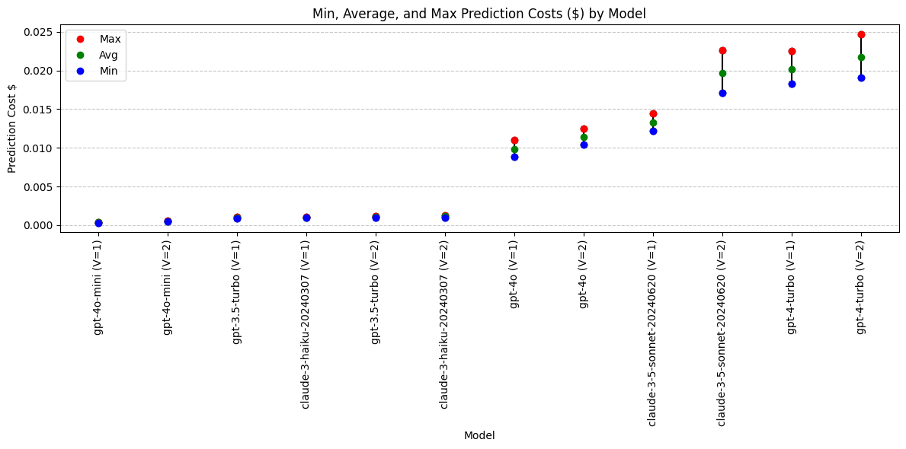

**Conclusions: Prediction Cost**

Four pricing tiers - UPDATED

Low:

- gpt-4o-mini
- gpt-3.5-turbo
- claude-3-haiku

Medium:

- gpt-4o

High:

- claude-3.5-sonnet (moved up)
- gpt-4-turbo

Highest (excluded):

- claude-3-opus

Cost conclusions:
Claude-3-opus is an outlier in high cost. Claude 3.5 sonnet should be in the same pricing tier as gpt-4-turbo.

Models with lowest cost:

- gpt-4o-mini
- gpt-3.5-turbo
- claude-3-haiku

## **Analysis: Output Tokens with Prompt Versions**

What impact did changing the prompt have on output tokens?

- V=1: First version
- V=2: Updated system_prompt and JSON_schema to demand Differential Diagnosis and correct medication spelling/formatting

```python
# Exclude claude-3-opus model
df = df.loc[df['model'] != 'claude-3-opus-20240229']

avg_output_tokens = df.groupby(['model', 'prompt_version'])['output_tokens'].mean().reset_index(name='avg_output')

grouped_output = df.groupby(['model', 'prompt_version'])['output_tokens'].agg(['min', 'max']).reset_index()
grouped_output = pd.merge(grouped_output, avg_output_tokens, on=['model', 'prompt_version'])

grouped_output = grouped_output.sort_values(by=['model', 'prompt_version'])


grouped_output['model'] = grouped_output['model'] + ' (V=' + grouped_output['prompt_version'].astype(str) + ')'

grouped_output = grouped_output.drop(columns = ['prompt_version'])

grouped_output = grouped_output.sort_values(by='avg_output')

print(grouped_output)
```

                                   model  min   max  avg_output
    4                gpt-3.5-turbo (V=1)  253   376      312.35
    8                       gpt-4o (V=1)  284   426      348.05
    5                gpt-3.5-turbo (V=2)  283   411      351.65
    6                  gpt-4-turbo (V=1)  299   438      359.35
    10                 gpt-4o-mini (V=1)  300   440      367.20
    7                  gpt-4-turbo (V=2)  294   482      382.00
    9                       gpt-4o (V=2)  354   496      423.60
    2      claude-3-haiku-20240307 (V=1)  469   573      511.10
    11                 gpt-4o-mini (V=2)  471   758      555.30
    3      claude-3-haiku-20240307 (V=2)  444   694      590.85
    0   claude-3-5-sonnet-20240620 (V=1)  538   684      607.45
    1   claude-3-5-sonnet-20240620 (V=2)  841  1208     1012.05

```python
plt.figure(figsize=(12, 6))

for i, row in grouped_output.iterrows():
    plt.plot([row['model'], row['model']], [row['min'], row['max']], color='black', linestyle='-', marker='o')
    plt.plot(row['model'], row['max'], 'ro', label='Max' if i == 0 else "")
    plt.plot(row['model'], row['avg_output'], 'go', label='Avg' if i == 0 else "")
    plt.plot(row['model'], row['min'], 'bo', label='Min' if i == 0 else "")

plt.xlabel('Model')
plt.ylabel('Output Tokens')
plt.title('Min, Max, and Average Output Tokens by Model')
plt.xticks(rotation=90)
plt.legend(loc='best')
plt.grid(axis='y', linestyle='--', alpha=0.7)

plt.tight_layout()
plt.show()
```

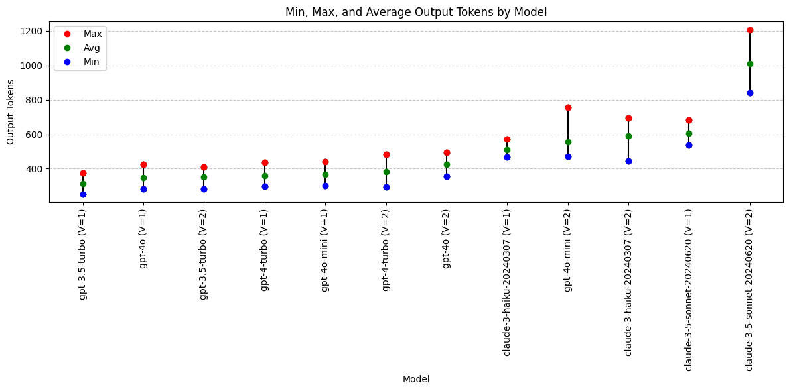

**Output Token Conclusions**

- Anthropic's Claude models generally produce more verbose outputs compared to OpenAI's GPT models. However, with the revised prompt, the gpt-4o-mini model now generates outputs of comparable length to those of the Claude models.
- With the revised prompt, claude-3.5-sonnet is now an outlier in long output length. Inspect these outputs closely (especially in the Differential Diagnosis field) to see what is going on.

Models with output token preference:

- Not applicable. Longer/shorter is not necessarily better.

## **Analysis: Differential Diagnosis**

- Was a Differential Diagnosis returned? If so, what was the average length?
- How many Differential Diagnosis values included "alternative treatments" as requested in the system prompt?

```python
# Function to calculate the length of differential diagnosis or zero if empty
def diagnosis_length(diagnosis: str):
    return len(diagnosis) if diagnosis else 0
```

```python
# Exclude claude-3-opus model
df = df.loc[df['model'] != 'claude-3-opus-20240229']

df['differential_diagnosis'] = df['differential_diagnosis'].fillna('')

# Add a new column for the length of differential diagnosis
df['diff_diag_length'] = df['differential_diagnosis'].apply(diagnosis_length)

# Count the number of rows with a non-empty differential diagnosis
df['has_diff_diag'] = df['differential_diagnosis'].apply(lambda x: 1 if x else 0)

# Check if 'alternative' is in the differential diagnosis
df['has_alternative'] = df['differential_diagnosis'].apply(lambda x: 1 if 'alternative' in x.lower() else 0)

# Calculate the average length of differential diagnosis
avg_diff_length = df.groupby(['model', 'prompt_version'])['diff_diag_length'].mean().reset_index(name='avg_diff_length')

# Count the number of rows with a non-empty differential diagnosis
total_diff_diag = df.groupby(['model', 'prompt_version'])['has_diff_diag'].sum().reset_index(name='total_diff_diag')

# Count the number of rows with 'alternative' in the differential diagnosis
total_alternative = df.groupby(['model', 'prompt_version'])['has_alternative'].sum().reset_index(name='total_alternative')

# Merge the results
grouped_output = pd.merge(avg_diff_length, total_diff_diag, on=['model', 'prompt_version'])
grouped_output = pd.merge(grouped_output, total_alternative, on=['model', 'prompt_version'])

# Append temperature to the model name
grouped_output['model'] = grouped_output['model'] + ' (V=' + grouped_output['prompt_version'].astype(str) + ')'

# Drop the temperature column
grouped_output = grouped_output.drop(columns=['prompt_version'])

# Sort the DataFrame by avg_diff_length in ascending order
grouped_output = grouped_output.sort_values(by='avg_diff_length', ascending=True)

print(grouped_output)
```

                                   model  avg_diff_length  total_diff_diag  \
    8                       gpt-4o (V=1)           150.80               20
    7                  gpt-4-turbo (V=2)           155.65               20
    9                       gpt-4o (V=2)           157.80               20
    2      claude-3-haiku-20240307 (V=1)           190.65               20
    4                gpt-3.5-turbo (V=1)           196.95               17
    0   claude-3-5-sonnet-20240620 (V=1)           201.10               20
    10                 gpt-4o-mini (V=1)           227.85               20
    5                gpt-3.5-turbo (V=2)           244.80               20
    6                  gpt-4-turbo (V=1)           261.05               20
    3      claude-3-haiku-20240307 (V=2)           299.30               20
    11                 gpt-4o-mini (V=2)           376.10               20
    1   claude-3-5-sonnet-20240620 (V=2)          1307.85               20

        total_alternative
    8                   6
    7                   4
    9                   6
    2                   5
    4                   8
    0                   4
    10                 17
    5                  20
    6                  13
    3                  14
    11                 19
    1                  20

```python

# Plotting the data
fig, ax1 = plt.subplots(figsize=(12, 8))

# Bar chart for total differentials
bar1 = ax1.bar(grouped_output['model'], grouped_output['total_diff_diag'], label='Total Differential Diagnoses Returned', color='skyblue', edgecolor='skyblue')

# Bar chart for differentials that include "alternative"
bar2 = ax1.bar(grouped_output['model'], grouped_output['total_alternative'], label='Differentials included alternative treatment', color='lightcoral')

# Secondary y-axis for average differential diagnosis length
ax2 = ax1.twinx()
ax2.plot(grouped_output['model'], grouped_output['avg_diff_length'], color='green', marker='o', linestyle='', linewidth=2, markersize=8, label='Average Differential Diagnosis Length')

# Customizing the plot
ax1.set_xlabel('Model (Temperature)')
ax1.set_ylabel('Number of Differential Diagnoses Returned')
ax2.set_ylabel('Average Differential Diagnosis Length (characters)')
ax1.set_title('Inclusion of Differential Diagnosis by Model, Two Prompt Versions')
ax1.set_xticks(range(len(grouped_output['model'])))
ax1.set_xticklabels(grouped_output['model'], rotation=45, ha='right')
ax1.legend(loc='upper left', bbox_to_anchor=(0.0, 1.15), ncol=2)
ax2.legend(loc='upper right', bbox_to_anchor=(1.0, 1.15), ncol=1)
ax1.grid(axis='y', linestyle='--', alpha=0.7)

# Display the plot
plt.tight_layout()
plt.show()
```

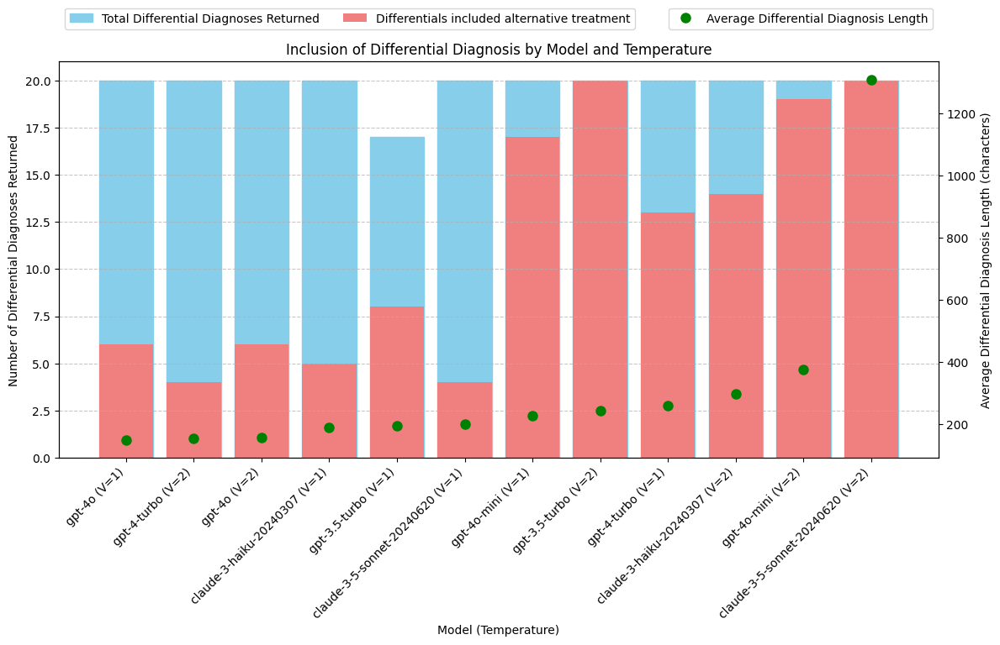

**Conclusions: Differential Diagnosis**

The Claude-3.5-Sonnet model, using the new prompt, produces Differential Diagnosis outputs that are 3 to 5 times longer than those from other models.

Manual review indicates that these longer outputs are of high quality and significantly enrich the SOAP notes.

**Best Models for Differential Diagnosis:**

- Claude-3.5-Sonnet: Consistently provides a detailed Differential Diagnosis along with alternative treatment options, as requested. Notably produces longer, more comprehensive responses.
- gpt-3.5-turbo: Also reliably returns a Differential Diagnosis with alternative treatment options.
- gpt-4o-mini: Almost always returns a Differential Diagnosis with alternative treatment options. Good response length.

## **Analysis: Fixing Transcription Errors**

The transcript includes the text "Vicodin 5-3, 25 milligrams" for when the speaker said "Vicodin five slash three twenty-five milligrams." This should have been transcribed as "Vicodin 5/325 milligrams."

The dosage of medications is typically written with a slash ("/") to clearly separate the amounts of each ingredient. "5" represents the amount of hydrocodone (usually in milligrams), and "325" represents the amount of acetaminophen (also in milligrams).
"Vicodin 5/325" means each tablet contains 5 mg of hydrocodone and 325 mg of acetaminophen.

The transcript also includes a spelling error related to a medication name: "flexor all 20 milligram tablets" should be "Flexeril 20 milligram tablets".

While this was not specifically requested in the prompt, some of the models caught these mistakes in the transcript and automatically fixed them in the response.

```python
# Function to calculate whether the soap_plan includes the text 5/325
def check_formatting(soap_plan: str):
    return 1 if "5/325" in soap_plan else 0
```

```python
# Function to calculate whether the soap_plan includes the text flexeril
def check_spelling(soap_plan: str):
    return 1 if "flexeril" in soap_plan.lower() else 0
```

```python
# Exclude claude-3-opus model
df = df.loc[df['model'] != 'claude-3-opus-20240229']

# Add a new column to store whether soap_plan includes corrrect formatting of 5/325
df['corrected_formatting'] = df['soap_plan'].apply(check_formatting)

# Add a new column to store whether soap_plan includes corrected spelling of flexeril
df['corrected_spelling'] = df['soap_plan'].apply(check_spelling)

# Count the number of rows with correct formatting
total_formatted = df.groupby(['model', 'prompt_version'])['corrected_formatting'].sum().reset_index(name='total_formatted')

# Count the number of rows with correct spelling
total_spelling = df.groupby(['model', 'prompt_version'])['corrected_spelling'].sum().reset_index(name='total_spelling')

# Merge the results ()
grouped_output = pd.merge(total_formatted, total_spelling, on=['model', 'prompt_version'], how='inner')

# Append prompt_version to the model name
grouped_output['model'] = grouped_output['model'] + ' (V=' + grouped_output['prompt_version'].astype(str) + ')'

# Drop the prompt_version column
grouped_output = grouped_output.drop(columns=['prompt_version'])

# Sort the DataFrame by total_formatted in ascending order
grouped_output = grouped_output.sort_values(by='total_formatted', ascending=True)

print(grouped_output)
```

                                   model  total_formatted  total_spelling
    0   claude-3-5-sonnet-20240620 (V=1)                0              20
    10                 gpt-4o-mini (V=1)                0              20
    1   claude-3-5-sonnet-20240620 (V=2)                1              20
    3      claude-3-haiku-20240307 (V=2)                1              19
    4                gpt-3.5-turbo (V=1)                1               7
    6                  gpt-4-turbo (V=1)                2               9
    2      claude-3-haiku-20240307 (V=1)                3              20
    11                 gpt-4o-mini (V=2)                4              20
    7                  gpt-4-turbo (V=2)                6              16
    5                gpt-3.5-turbo (V=2)               12               8
    8                       gpt-4o (V=1)               16              20
    9                       gpt-4o (V=2)               17              20

```python

# Plotting the data
fig, ax1 = plt.subplots(figsize=(12, 8))

bar_width = 0.35
opacity = 0.8

# Bar chart for total corrected values
bar1 = ax1.bar(grouped_output['model'], grouped_output['total_formatted'], width=bar_width, label='Corrected Medication Formatting', color='skyblue', edgecolor='skyblue')
bar2 = ax1.bar([x + bar_width for x in range(len(grouped_output['model']))], grouped_output['total_spelling'], width=bar_width, label='Corrected Medication Spelling', color='lightcoral')

# Customizing the plot
ax1.set_xlabel('Model (Version)')
ax1.set_ylabel('Number of Corrections Made')
ax1.set_title('Correction of Transcription Errors')
ax1.set_xticks(range(len(grouped_output['model'])))
ax1.set_xticklabels(grouped_output['model'], rotation=90, ha='right')
ax1.legend(loc='upper left', bbox_to_anchor=(0.0, 1.15), ncol=2)
ax1.grid(axis='y', linestyle='--', alpha=0.7)

# Display the plot
plt.tight_layout()
plt.show()
```

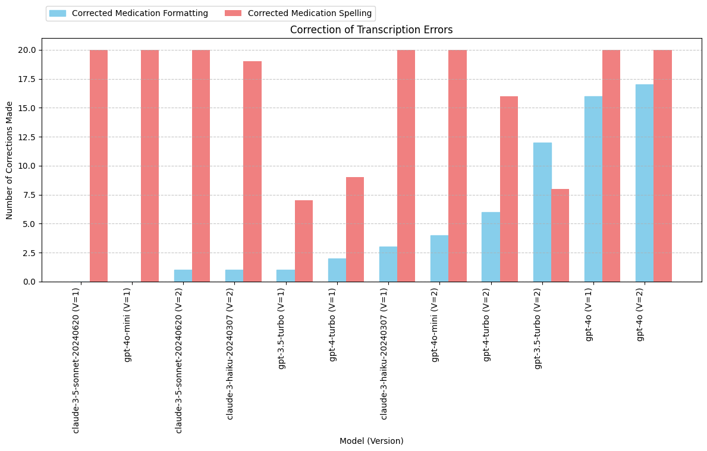

**Conclusions: Fixing Transcription Errore**

**General improvement with prompt update**:

- All of the models, except for Claude-3-Haiku, showed performance improvement in detecting transcription errors with the updated prompt.

**Best model for fixing transcription errors**:

- GPT-4o excelled at identifying spelling and formatting errors in prescription medications, outperforming all other models even with the initial prompt (Prompt V1).

**General Observations**:

- The updated system prompt and JSON schema have enhanced the detection of medication transcription errors, but issues persist, particularly with formatting. Spelling errors are generally easier to identify than formatting issues. It may be beneficial to provide the prompt with examples of correct medication formatting to further reduce errors.

## **CONCLUSIONS**

### **Model Rankings by Criteria**

To determine the "best model," it's crucial to identify and evaluate the most important criteria for your use case. Model performance can vary significantly across these criteria. The following rankings are organized from the most to least important criteria for this particular application:

**Lowest cost:**

1. gpt-4o-mini
2. claude-3-haiku
3. gpt-3.5-turbo

**Inclusion of Differential Diagnosis and alternative treatment:**

1. claude-3.5-sonnet (long, very thorough)
2. gpt-3.5-turbo
3. gpt-4o-mini

**Fixing transcription errors:**

1. gpt-4o

**Quick, consistent prediction times:**

1. claude-3-haiku
2. gpt-3.5-turbo

### **Understand How Your _Prompt_ Affects Model Performance.**

Changing the prompt can significantly alter model ranking. For instance, adjusting the prompt may lead to notable changes in output length for some models while affecting others minimally. A model that was previously cost-effective might shift to a higher pricing tier with a new prompt.

### **Use Prompt Development to "Pass Desired Traits" Between Models**

If you select gpt-4o-mini for its low cost and acceptable performance on Differential Diagnosis but have concerns about its transcription error handling, consider enhancing the prompt with a dictionary of common prescription names and detailed formatting instructions.

To increase the length and detail of the Differential Diagnosis, you can use outputs from claude-3.5-sonnet as few-shot examples or set a character length minimum in the JSON schema to guide other models.

By systematically evaluating model outputs in this way, you can incorporate the content or structure of the best model outputs into your prompt and avoid having to compromise on model selection.

As a result of building and running this notebook, I have switched to using gpt-4o-mini for the time being based on its cost-effectiveness and performance in the Differential Diagnosis field. As discussed above, I have a clear strategy for further refining the prompt to enhance both Differential Diagnosis results and transcription error correction in gpt-4o-mini.

Finally, I am better prepared to quickly evaluate and compare new models as they become available, ensuring that I can effectively assess performance differences and make informed decisions about model selection for this specific use case.

### **Takeaways**:

- **Doing "evals" is not simply a choice between manual human review or using an AI to grade outputs.** There is a third way. Data analysis can provide valuable insights for both prompt and model evaluations.
- Improving the prompt can change model rankings. Use prompt improvement (system prompt + JSON schema) to "pass" desired traits from one model into another model. **Fully optimize the prompt before drawing conclusions about the "best model."**
- **Have a plan** in place for systematically testing new models once they are released.
